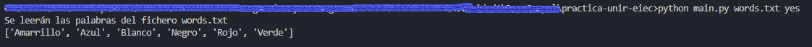

# UNIR - Taller EIEC

El presente repositorio se usó como base para el desarrollo de la Actividad Grupal N° 1, correspondiente a la asignatura de Entornos de integración y Desarrollo Continuo.

## Requisitos
* **Python 3.x.x:** : Se debe contar con Python instalado y configurado de manera correcta. El siguiente link puede ser usado como referencia: [Descargar e Instalar Python](https://www.youtube.com/watch?v=j_ngd_1j7ME)

* **Archivo (.txt):** Este archivo contiene los datos a procesar, para este caso puntual una lista de palabras, el archivo puede estar en la raíz de la solución o en otro directorio.

## Ejecución

Desde la linea de comandos, ejecutar la siguiente sentencia:

`python main.py <filename> <duplicidad> <orden>`

**Donde:** 

* **filename:** es la ruta al fichero (files/words.txt) que contiene la lista de palabras, una por línea.

* **duplicidad:** criterio de duplicidad **(yes|no)**, "yes" para eliminar palabras duplicadas, "no" para mantener la lista.

* **orden:** criterio de ordenamiento **(yes|no)**, "yes" para ordenar las palabras, "no" para mantener la lista.
  
## Resultado

---